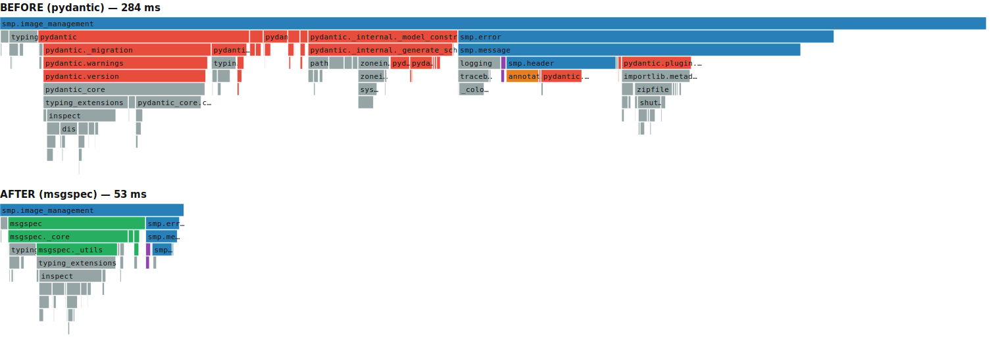

# msgspec migration — proof-of-concept benchmarks

A spike converting the `image_management` group (and its import chain: `header`,
`message`, `error`) from **pydantic** to **msgspec.Struct + cbor2**, to quantify
the import-time win for [#26](https://github.com/JPHutchins/smp/issues/26) and
prove the wire format is unchanged.

## Headline

| metric | before (pydantic) | after (msgspec) | change |
|---|--:|--:|--:|
| per-invocation import `from smp import image_management` (wall, mean of 20) | 312.3 ms | 86.9 ms | **3.6× faster** |
| `-X importtime` cumulative for `smp.image_management` | 283.5 ms | 53.0 ms | **5.4× less** |
| deserialize `ImageStatesReadResponse` (2 images) | 46.8 µs | 10.7 µs | **4.4× faster** |
| deserialize `ImageUploadWriteRequest` (1 KiB) | 22.5 µs | 8.3 µs | **2.7× faster** |
| serialize `ImageStatesReadResponse` (2 images) | 37.6 µs | 37.0 µs | ~flat |
| serialize `ImageUploadWriteRequest` (1 KiB) | 19.3 µs | 17.3 µs | ~flat |

- These are **fresh-interpreter imports with a warm `.pyc` + page cache** — i.e.
  exactly what an installed CLI (pipx/uvx, `python -m ...`) pays on *every*
  invocation, since the bytecode is compiled once at install/first-run and then
  reused. A new process can't reuse another's `sys.modules`, so there is no faster
  "warm" tier for a CLI: 86.9 ms is the steady-state per-launch cost, not a cold
  outlier. (Re-importing within one *long-running* process is ~0.24 µs, but that
  only helps long-lived processes.) The only slower case is the very first run
  before the `.pyc` exists — a one-time compile, which these numbers exclude.
- **Serialize is ~flat** because it is bound by `cbor2` canonical encoding
  (`cbor2._cbor2.dumps`), not the object layer — see the de/ser flame graph. The
  decode path is where msgspec (`msgspec.convert`) wins big.

## Byte-exactness

The new `Frame`/`Data` API is byte-identical to the locked regressions:

```
smp.image_management: 27322 records
  serialize byte-identical:   27322/27322
  deserialize round-trip:     27322/27322
```

## Import cost, before vs after (shared time scale)



The `pydantic` subtree (red) that dominates the "before" import is gone; "after"
is the `msgspec` C extension (green) plus a one-time `typing_extensions`/`inspect`
pull.

## Reproduce

```sh
uv run python benchmarks/import_time.py 20
uv run python benchmarks/deser_bench.py
uv run python benchmarks/byte_exactness.py smp.image_management

# flame graphs (icicle from -X importtime; cProfile flame for de/ser)
uv run python -X importtime -c "from smp import image_management" 2> before.txt   # on main
uv run python -X importtime -c "from smp import image_management" 2> after.txt    # on this branch
uv run python benchmarks/importtime_icicle.py --compare before.txt after.txt --root smp.image_management > compare.svg
```

## Caveats (this is a spike, not the final rework)

- Only `image_management` + its import chain are converted; the other groups still
  import pydantic, so a full `from smp import ...` is not yet representative.
- Deferred parity items: `HashBytes` rich-repr, the `hash` field validator,
  `ErrorV2.err.group` typing (msgspec rejects the `GroupId | UserGroupId | int`
  union — see below).
- **msgspec-cbor gap:** its `encode()` exposes msgspec's lexicographic `order=`
  but not cbor2's length-first `canonical=True`, which the wire format requires.
  The encode path therefore reimplements `to_builtins() + cbor2.dumps(canonical=True)`
  (flagged as a KLUDGE in `message.py`). Adding canonical ordering to
  `msgspec_cbor.encode()` would remove that and likely speed up serialize.
